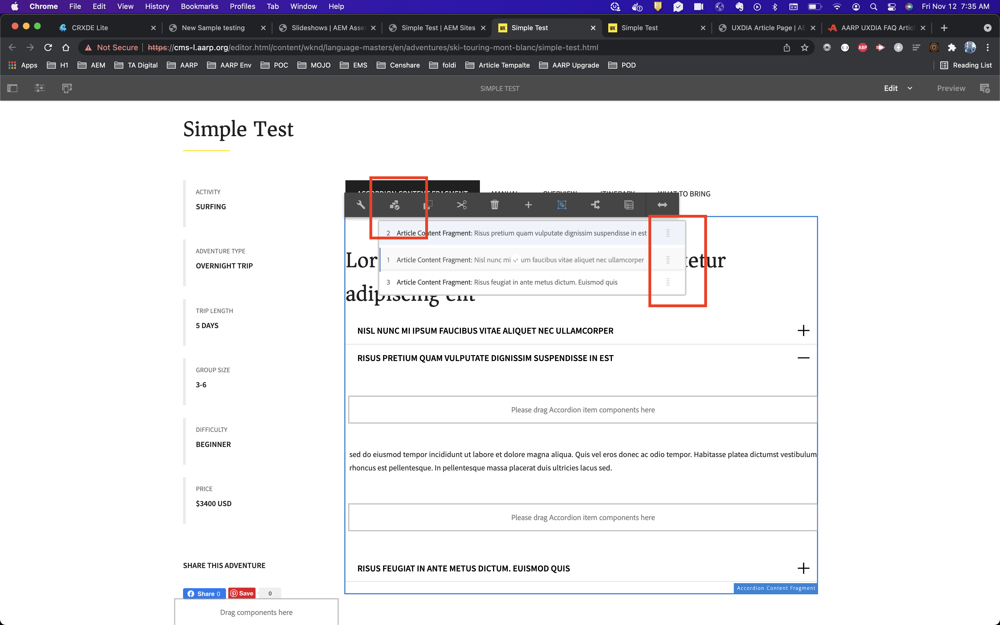

# AccordionContentFragment
This code repo contans working code of support for content fragment with Accordion core component support and this code will automattically pulls the content fragment Q&A
Youn can read more about the usuage of this use case on my blog: 

